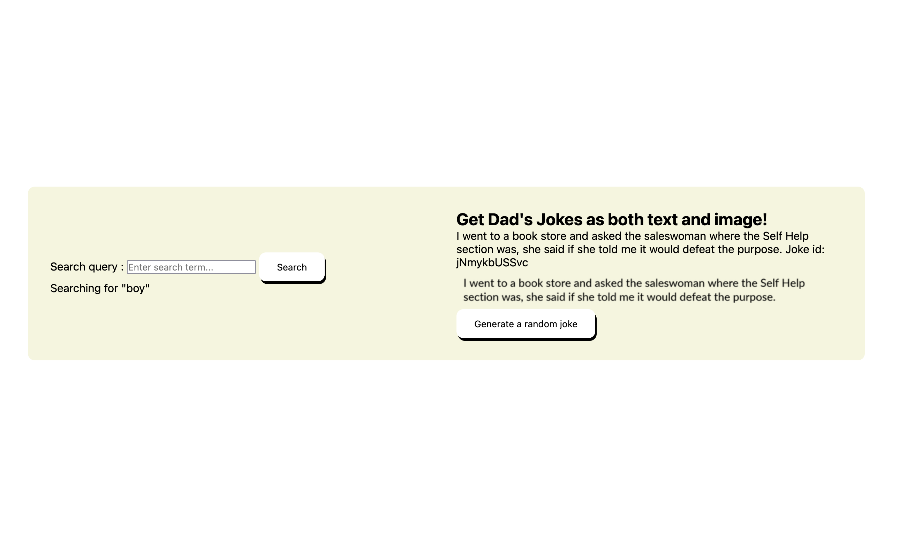

# API's Workout

This project serves as a reinforcement on `APIs` & Introduction to `modular` code.

## Project Specific Requirements: API Integration

1. The design must be close to `design/`. Check the `.mp4` video for expected behaviour.

2. A user can get random jokes. Each joke must be in text and image format. See `design/` for more details.

3. Each joke must present its `id` which is also present in the `API` response.

4. A user can search jokes by `term`. See `design/` for more details. Each search must be limited to `5` results. The `API` might have more than `10` to `20` joke results. A user can only see at most `5` jokes.

5. If a `term` does not yield any results, the user should be able to get the following visual feedback: `Term <term> does not yield any results`.

6. Be mindful of your `HTML` and how you would approach semantic `HTML` for a `search box` component.

7. The API docs is found [here](https://icanhazdadjoke.com/api)

## Dev Tools

For this project you need to setup `stylelint`, `eslint` and `prettier`.
Make sure these tools are working together to help follow code standards!

## Git Branching

If you need a refresher on `Git Branching`. Check [this](https://www.theodinproject.com/lessons/foundations-revisiting-rock-paper-scissors) out.

> [!IMPORTANT]
> This project requires you to setup `Git` and `GitHub`. Use what we have learned so far: **Feature Branching Strategy** is required. You must utilize `Branching`, `Merging`, `Pulling`, and `Pushing`. Also, use `git merge <branch> --no-ff` to preserve branch history. When showcasing your project, you should show your development branch.
